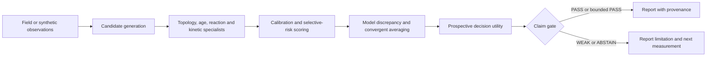

# Figure 1 source: HydroSheaf evidence-to-claim flow

```mermaid
flowchart LR
  A[Field or synthetic observations] --> B[Candidate generation]
  B --> C[Topology, age, reaction and kinetic specialists]
  C --> D[Calibration and selective-risk scoring]
  D --> E[Model discrepancy and convergent averaging]
  E --> F[Prospective decision utility]
  F --> G{Claim gate}
  G -->|PASS or bounded PASS| H[Report with provenance]
  G -->|WEAK or ABSTAIN| I[Report limitation and next measurement]
```
