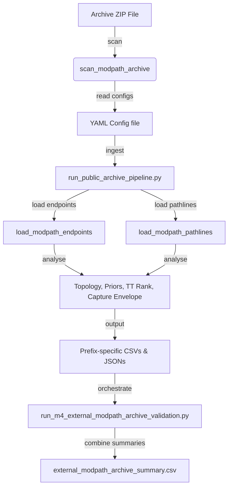

# Handoff for Coders: MODPATH-to-Graph Validation Pipeline

This document details the design, architecture, and extension instructions for the public-archive MODPATH-to-graph validation pipeline inside the Hydrosheaf M4 benchmark.

## Pipeline Architecture

The pipeline consists of the following key components:

1. **Config Schemas (`configs/archive_schema.yaml`)**:
   Enforces required fields for each archive metadata config, including version, files in zip, coordinate matches, and source identifiers.
2. **Ingestion Module (`hydrosheaf/validation/modpath_archive.py`)**:
   - Extracts and standardises columns from MODPATH files.
   - Reuses fast compact parsers for MODPATH 5/6 and uses `flopy` for MODFLOW 6 / MODPATH 7 formats.
   - Maps particle starting/ending cells and coordinates to build topology.
3. **Execution Script (`M4/m4_topology_benchmark/scripts/run_public_archive_pipeline.py`)**:
   - Computes precision, recall, and F1 topology scores.
   - Computes particle-based capture envelope IoU (Convex Hull intersections).
   - Computes Spearman/Kendall travel time rank correlation diagnostics.
   - Standardises and generates bootstrap confidence intervals.
4. **Orchestrator (`M4/m4_topology_benchmark/scripts/run_m4_external_modpath_archive_validation.py`)**:
   - Sequentially triggers pipeline runs for all target archives.
   - Concatenates summaries into `results/external_modpath_archive_summary.csv` in strict order (Savage as row 0, Great Miami as row 1, Long Island as row 2).
   - Copies Savage detailed files to default names for downstream script compatibility.

---

## Adding a New Public Archive

To add a new archive to the validation pipeline:

1. **Create Config**: Create a new `<archive_name>.yaml` file under `M4/m4_topology_benchmark/configs/`.
2. **Validate Setup**: Run `inspect_public_archive.py --config configs/<archive_name>.yaml` to verify that the file paths are correctly mapped and readable.
3. **Add to Orchestrator**: Update the `configs` list in `run_m4_external_modpath_archive_validation.py` (lines 22-26) to include the new config file.
4. **Integrate Results**: If the new archive changes the expected summary formatting, update the manuscript generators (`make_publication_tables.py` and `make_publication_figures.py`) to process the new data.

---

## Key Core Metric Computation

* **Topology Metrics**: Calculated using standard directed edge classifications (TP, FP, FN).
* **Convex IOU**: Intersects the Convex Hull of starting point clouds grouped by target receptor cell nodes to measure capture-envelope overlaps.
* **Travel-Time Rank Correlation**: Spearman $\rho$ and Kendall $\tau$ are computed on matched pathline transit times and endpoint arrival times to diagnose scale and rank discrepancies.
* **Bootstrap CIs**: Resamples the matched edges and particles 2000 times (deterministic seed `20260521`) to compute 95% confidence intervals (`ci_low`, `ci_high`).
